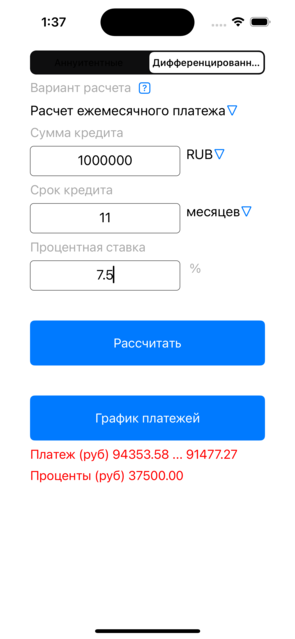
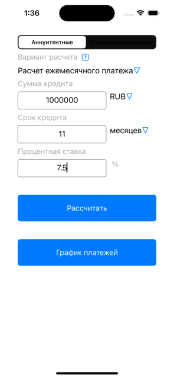
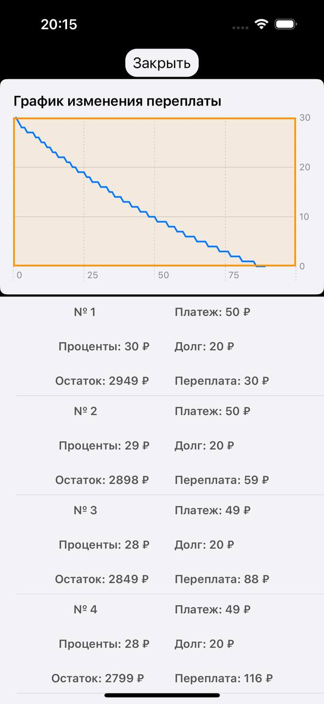
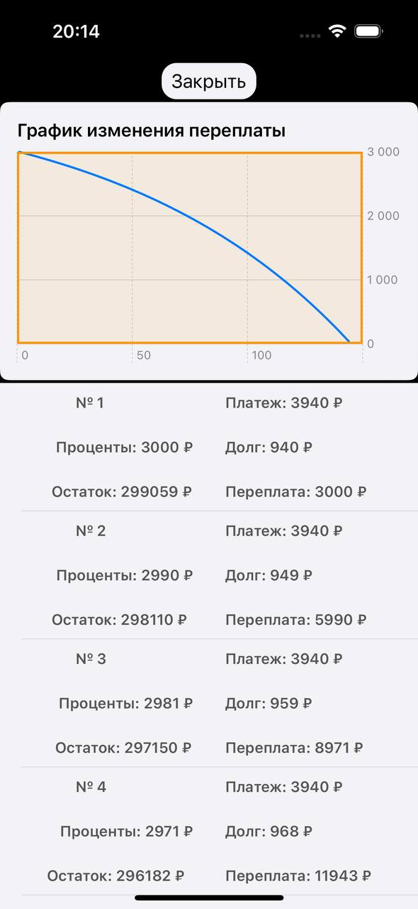

# Fincher

> **Проект больше не поддерживается.**
> Оставлен как учебный подпроект для ознакомления и истории. 
> Код может быть неполным, устаревшим или содержать учебные упрощения.

Приложение Fincher выполняет функцию кредитного калькулятора. Реализован функционал вычисления ежемесячного платежа, срока кредита и максимальной суммы кредита.

## Screenshots
<picture>
  <source media="(prefers-color-scheme: dark)" srcset="Screens/MainScreen1.png">
  <source media="(prefers-color-scheme: light)" srcset="Screens/MainScreen1.png">
  
</picture>
<picture>
  <source media="(prefers-color-scheme: dark)" srcset="Screens/MainScreen2.png">
  <source media="(prefers-color-scheme: light)" srcset="Screens/MainScreen2.png">
  
</picture>
<picture>
  <source media="(prefers-color-scheme: dark)" srcset="Screens/DetailsScreen1.jpg">
  <source media="(prefers-color-scheme: light)" srcset="Screens/DetailsScreen1.jpg">
  
</picture>
<picture>
  <source media="(prefers-color-scheme: dark)" srcset="Screens/DetailsScreen2.jpg">
  <source media="(prefers-color-scheme: light)" srcset="Screens/DetailsScreen2.jpg">
  
</picture>

## Описание решения
Проект выполнен без использования StoryBoard, все элементы созданы в коде и размещены с использованием Constraints. Проект выполнен в команде из двух человек.

## Описание функционала
На главном экране в StackView находятся:
- Segment Control для выбора типа платежа (аннуитетный или дифференцированный)
- DropDown для выбора типа калькулятора (ежемесячный платеж / срок кредита / максимальная сумма кредита). При выборе типа меняются поля ввода
- TextView для заполнения данными. Реализована проверка TextView на ввод. Разрешены только цифры.
- Кнопка "рассчитать", которая производит расчет для соответствующего типа. Если какие-то поля не заполнены, то расчет не производится, соответствующая функция выкидывает throw.
- Кнопка "график платежей", по которой открывается view с таблицей с графиком платежей, вычисленных по кнопке "рассчитать"

## Архитектурные и технологические решения
- UIKit
- SwiftUi
- Combine
- Localization
- MVVM
- Extensions
- Delegate
- Publishers
- Throwing functions

## Элементы дизайна
- StackView
- Buttons
- Labels
- DropDown
- TextView
- Segment Control
- TableView

## Авторы
- [@androidc](https://www.github.com/androidc) 
- [@Deni0S](https://www.github.com/Deni0S) 
